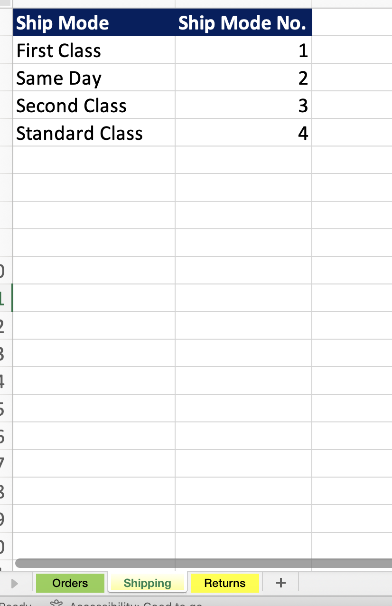
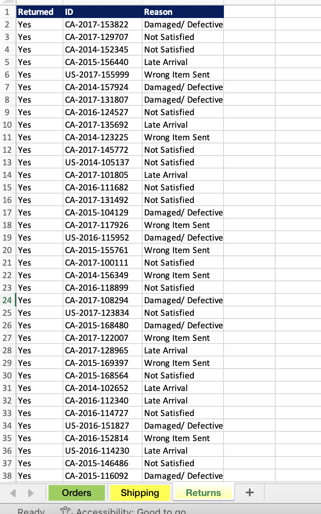
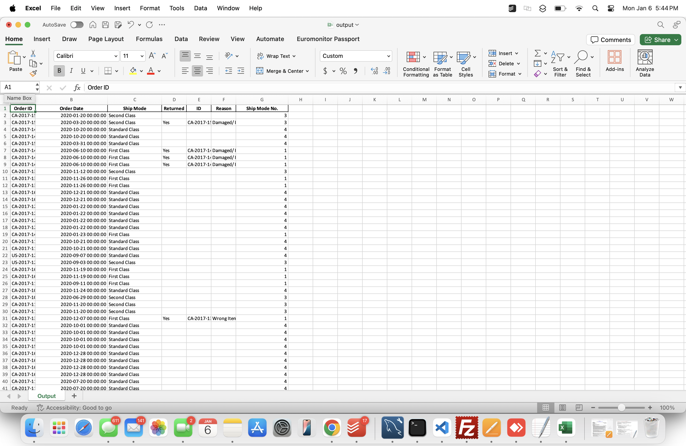

# Replace Excel VLOOKUP with Python and Pandas

## Introduction

The VLOOKUP function is one of the most widely used and powerful tools in Excel. However, when dealing with large datasets, VLOOKUP can slow down your workbook significantly. Python, with the help of the Pandas library, provides a faster and more efficient alternative to perform lookups, and it also allows for automating repetitive Excel tasks. This README explains how to replace VLOOKUP in Excel using Python and Pandas, and how to generate an output Excel file from the lookup operation.

## Prerequisites

Before proceeding, ensure you have the following installed on your system:

- Python 3.x
- Pandas library
- OpenPyXL library (for handling Excel files)
- Jupyter Notebook or any Python IDE (optional)

You can install the required libraries using the following command:

```bash
pip install pandas openpyxl
```

## Files Overview

The following files are used in this project:

1. `data.xlsx` - Contains the datasets for the lookup operation.
2. `output.xlsx` - The output file generated after performing the lookup.
3. `app.ipynb` - The Jupyter Notebook script to perform the lookup using Pandas.

## How to Perform Lookup in Pandas

Below is a step-by-step guide to replacing Excel VLOOKUP with Python:

### Step 1: Load the Data




Use Pandas to read the datasets from the `data.xlsx` file. For example:

```python
import pandas as pd

# Load data
data1 = pd.read_excel('data.xlsx', sheet_name='Sheet1')
data2 = pd.read_excel('data.xlsx', sheet_name='Sheet2')
```

### Step 2: Perform the Lookup

Use Pandas' `merge` function to perform a lookup operation, similar to VLOOKUP in Excel:

```python
# Perform the lookup
result = pd.merge(data1, data2, on='KeyColumn', how='left')
```

- `KeyColumn` is the column used as the lookup key.
- `how='left'` ensures all rows from `data1` are retained, similar to VLOOKUP.

### Step 3: Save the Output

Save the resulting dataset to a new Excel file:

```python
result.to_excel('output.xlsx', index=False)
```



## Advantages of Using Python for Lookups

- **Speed**: Pandas is optimized for large datasets, making it much faster than Excel.
- **Automation**: You can fully automate the lookup process and other Excel-related tasks.
- **Flexibility**: Pandas provides more powerful data manipulation capabilities compared to Excel.

## Example Workflow

1. Place your datasets in `data.xlsx` with the required lookup columns.
2. Run the `app.ipynb` script to perform the lookup.
3. Open the `output.xlsx` file to view the results.

## Conclusion

Replacing Excel VLOOKUP with Pandas allows for efficient and automated data processing. By using Python, you can unlock the full potential of data analysis and eliminate the limitations of Excel in handling large datasets. Happy coding!

